# Model-Forward Clinical Abstraction Platform

## Architecture Overview

This platform leverages a model-forward approach to clinical data abstraction, combining structured data engineering with Large Language Models (LLMs) to assist clinicians and abstractors in quality reporting and clinical decision support.

## System Architecture

### High-Level Overview

```mermaid
flowchart TD
    Source["📊 Clinical Source Systems<br/>EHR | Devices | Registries"]
    Platform["☁️ Data & AI Platform<br/>Snowflake-Centric"]
    Cognitive["🧠 Model-Forward Middle Tier<br/>Data & Abstraction Agents"]
    Apps["🏥 Clinical Applications<br/>CLABSI | NAKI | UE | Ortho | Cardiac"]
    Users["👥 Clinicians & Abstractors"]

    Source ==> Platform
    Platform ==> Cognitive
    Cognitive ==> Apps
    Apps <==> Users

    style Source fill:#e1f5ff
    style Platform fill:#fff4e1
    style Cognitive fill:#ffe1f5
    style Apps fill:#e1ffe1
    style Users fill:#f0f0f0
```

### Detailed Architecture

```mermaid
flowchart TD
    %% SOURCE SYSTEMS
    subgraph Source["📊 LAYER 1: Clinical Source Systems"]
        EHR["Caboodle / Clarity<br/>EHR Extracts"]
        OtherSrc["Other Feeds<br/>Devices, Registries, Externals"]
    end

    %% DATA PLATFORM
    subgraph Platform["☁️ LAYER 2: Data & AI Platform - Snowflake"]
        direction TB
        Ingest["Ingest & Orchestration<br/>Snowpipe, Streams/Tasks, Coalesce"]

        subgraph DataLayers["Data Refinement Pipeline"]
            Silver["SILVER<br/>Raw-Normalized Facts"]
            Gold["GOLD<br/>Domain Models & Metrics"]
            GoldAI["GOLD_AI<br/>LLM-Ready Payloads"]
        end

        Vec["Vector Store<br/>Semantic Chunks"]
        Ledger["Signal Ledger<br/>Cases, QA, Decisions"]

        Ingest --> Silver
        Silver --> Gold
        Gold --> GoldAI
        GoldAI --> Vec
        GoldAI --> Ledger
    end

    %% MODEL-FORWARD MIDDLE TIER
    subgraph Cognitive["🧠 LAYER 3: Model-Forward Middle Tier"]
        direction TB

        subgraph DataAgent["Data Agent"]
            Tools["Tool Layer<br/>SQL | Rules | Vector Search"]
            Planner["Orchestration<br/>Multi-step Planning"]
            LLM["LLM Runtime<br/>OpenAI | Writer | Cortex"]
        end

        subgraph AbstractionAgent["Abstraction Agent"]
            UXAPI["Abstraction API<br/>Domain Contracts"]
            Reasoner["Reasoning Engine<br/>Draft Generation"]
            QA["QA & Guardrails<br/>Validation"]
        end

        Tools --> Planner
        Planner --> LLM
        LLM --> Reasoner
        Reasoner --> QA
    end

    %% APPLICATIONS
    subgraph Apps["🏥 LAYER 4: Clinical Applications"]
        direction LR
        CLABSI["CLABSI<br/>Agent"]
        NAKI["NAKI<br/>Agent"]
        UE["Unplanned<br/>Extubation"]
        Ortho["SCH/Ortho<br/>Quality"]
        Flight["Cardiac<br/>Surgery"]
    end

    %% USERS
    Users["👥 Clinicians & Abstractors"]
    Feedback["📝 Clinical Feedback"]

    %% CONNECTIONS
    EHR --> Ingest
    OtherSrc --> Ingest

    GoldAI -.-> Tools
    Vec -.-> Tools
    Ledger -.-> Tools

    QA --> Ledger

    AbstractionAgent --> Apps
    Apps --> Users
    Users --> Feedback
    Feedback --> Ledger

    %% STYLING
    style Source fill:#e1f5ff
    style Platform fill:#fff4e1
    style Cognitive fill:#ffe1f5
    style Apps fill:#e1ffe1
    style Users fill:#f0f0f0
    style Feedback fill:#f0f0f0
```

<b>Click to expand full detailed diagram</b>

### Data Pipeline Details

### Model-Forward Agent Architecture

## Key Components

### 1. Clinical Source Systems
- **EHR Systems**: Caboodle/Clarity extracts from Epic or other EHR platforms
- **External Feeds**: Medical devices, clinical registries, and external data sources

### 2. Data & AI Platform (Snowflake-Centric)
- **Ingest & Orchestration**: Automated data ingestion using Snowpipe, Streams/Tasks, and Coalesce
- **SILVER**: Raw-normalized clinical facts layer
- **GOLD**: Domain-specific models and calculated metrics
- **GOLD_AI**: LLM-ready data payloads including clinical signals, patient timelines, and note bundles
- **Vector Store**: Semantic chunking and vector embeddings for patient/encounter context
- **Ledger**: Comprehensive tracking of signals, abstractions, decisions, and QA workflows

### 3. Model-Forward Middle Tier

#### Data Agent (Model-Forward Data Layer)
- **Tool Layer**: SQL execution, rules engine, validators, search, and vector retrieval
- **Planning & Orchestration**: Multi-step reasoning and tool use coordination
- **LLM Runtime**: Support for multiple LLM providers (OpenAI, Writer, Palmyra, Snowflake Cortex)

#### Abstraction Agent (Clinician-Facing)
- **Abstraction API**: Domain-specific contracts and UX schemas
- **Reasoning Engine**: Converts clinical signals into actionable summaries and draft abstractions
- **QA & Guardrails**: Automated validation, contradiction detection, and checklist enforcement

### 4. Clinical Abstraction Applications

Specialized agents for specific clinical quality and safety use cases:
- **CLABSI Agent**: Central Line-Associated Bloodstream Infection abstraction
- **NAKI Agent**: Neurological injury monitoring and reporting
- **Unplanned Extubation Agent**: Airway management safety events
- **SCH/Ortho Quality Agent**: Orthopedic surgery quality metrics
- **Cardiac Surgery/FlightPlan Companion**: Cardiovascular procedure support

## Data Flow

1. **Ingestion**: Clinical data flows from source systems into the Snowflake platform
2. **Refinement**: Data progresses through Silver → Gold → Gold_AI layers with increasing semantic enrichment
3. **Vectorization**: LLM-ready payloads are chunked and embedded for semantic search
4. **Agent Processing**: The Data Agent retrieves relevant context using tools and coordinates with the LLM runtime
5. **Clinical Abstraction**: The Abstraction Agent generates draft abstractions with QA validation
6. **Application Delivery**: Domain-specific agents present abstractions to clinicians
7. **Feedback Loop**: Clinical feedback and decisions are captured back into the ledger

## Benefits

- **Reduced Abstraction Time**: Automated draft generation reduces manual chart review time
- **Improved Accuracy**: Multi-layered QA and guardrails catch inconsistencies
- **Scalable Architecture**: Snowflake-native design supports enterprise-scale data volumes
- **Model-Agnostic**: Flexible LLM runtime supports multiple providers and models
- **Auditable**: Comprehensive ledger tracks all decisions and model outputs
- **Clinician-Centric**: Purpose-built agents for specific clinical workflows

## Technology Stack

- **Data Platform**: Snowflake (data warehouse, Snowpipe, Streams/Tasks)
- **Orchestration**: Coalesce, Snowflake native features
- **Vector Storage**: Snowflake Vector or dedicated vector DB
- **LLM Providers**: OpenAI, Writer, Palmyra, Snowflake Cortex
- **Source Systems**: Epic (Caboodle/Clarity), various clinical systems

## Getting Started

(Documentation to be added as the platform develops)

## Contributing

(Contribution guidelines to be added)

## License

(License information to be added)
