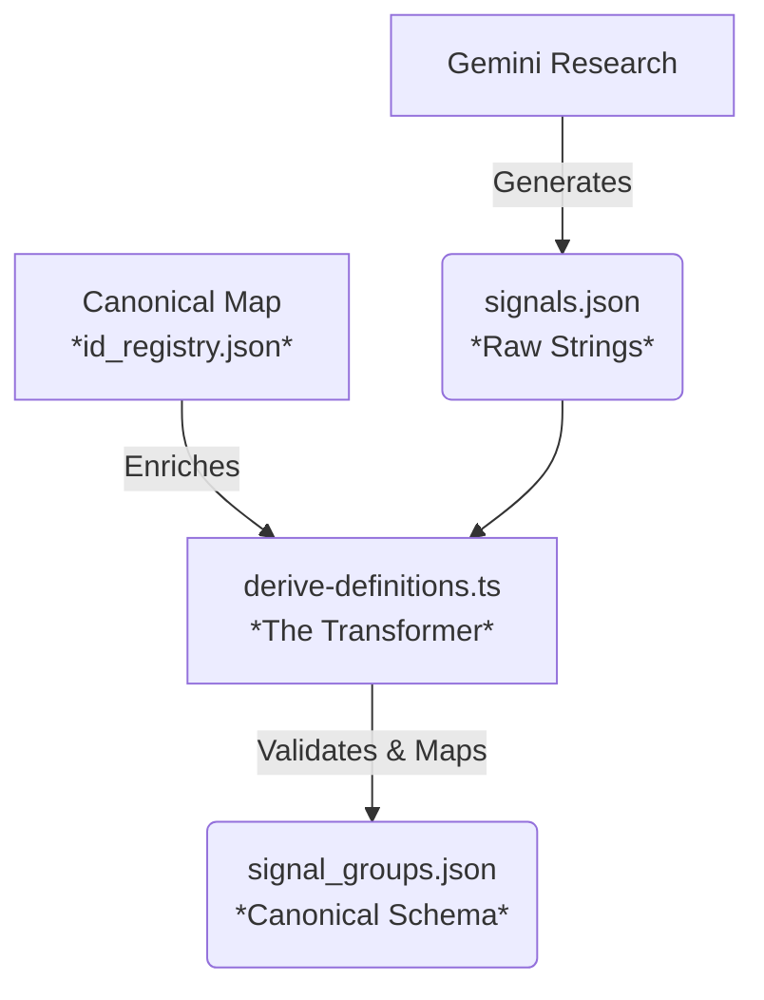

# Canonical Signal Architecture & Migration Strategy

**Context:** Remediation of "Negative ID" Regressions
**Target:** Moving from brittle, phrase-based IDs to stable, canonical IDs.

---

## 1. Canonical Schema Proposal

**Goal:** Separate the *stable concept* (ID) from the *variable phrasing/polarity* (Metadata).

### Proposed `signal_groups.json` Entry
```json
{
  "signal_id": "perfusion_check_documentation",  // CANONICAL: Positive, Stable, Noun-based
  "legacy_id": "absence_of_perfusion_checks",    // BACKWARD COMPAT: For Accountant/Tests
  "display_label": "Absence of Perfusion Checks", // UI: Human-readable phrase (from Gemini)
  "detection_mode": {
    "target_polarity": "negative",                // SEMANTICS: We are looking for the *absence* of this
    "trigger_phrases": [
      "not documented", 
      "no record of", 
      "absence of"
    ]
  },
  "evidence_rules": {
    "required": true,
    "type": "verbatim_text"
  }
}
```

### Why this fixes the root cause:
1.  **Stable ID:** `perfusion_check_documentation` doesn't change even if we tweak the phrasing to "Perfusion checks missing".
2.  **Explicit Polarity:** `target_polarity: "negative"` tells the Accountant/Evals that finding "No checks" is a **HIT** (match), preventing semantic inversion.
3.  **Traceability:** `display_label` preserves the original Gemini output for context.

---

## 2. Architecture: Where to Canonicalize?

**Rule:** `signal_groups.json` is a **Read-Only Artifact**. It must never be manually edited or "restored" in isolation.

### The "Derive" Pipeline


**Location:** `factory-cli/tools/derive-definitions.ts`
*   **Responsibility:** It reads the raw phrases from `signals.json`. It looks them up in `id_registry.json` (or applies strict normalization rules) to assign a Canonical ID.
*   **Restore Protection:** If you restore `signal_groups.json` (the artifact), the next CI build runs `derive-definitions` and **overwrites** it with the truth from `signals.json` + `id_registry.json`. This forces all changes upstream.

---

## 3. Deterministic Mapping Strategy

How to map `Antibiotic prophylaxis not given...` $\to$ `antibiotic_prophylaxis_compliance` without inversion errors.

### Strategy: The "Review & Map" Loop

We cannot rely purely on heuristic string parsing (stripping "not") because logic varies ("Uncontrolled pain" $\to$ `pain_control` vs `pain_level`?).

**Mechanism:**
1.  **Gemini** outputs strings into `signals.json`.
2.  **`derive-definitions.ts`** runs a **Pre-Flight Check**:
    *   For each phrase, try to find a match in `id_registry.json`.
    *   **If Match Found:** Use the mapped Canonical ID and Polarity.
    *   **If No Match:**
        *   Auto-generate a draft ID (e.g., `antibiotic_prophylaxis_not_given...`).
        *   Flag as `DRAFT/UNSTABLE`.
        *   **Fail the Build** (or Warn) requiring a human to add the entry to `id_registry.json`.

### `id_registry.json` Example
```json
{
  "mappings": [
    {
      "phrase_pattern": "not recorded|not documented|missing",
      "canonical_id": "{entity}_documentation",
      "polarity": "negative"
    },
    {
      "exact_phrase": "Antibiotic prophylaxis not given within 60 min",
      "canonical_id": "antibiotic_timing_compliance",
      "polarity": "negative",
      "description": "Checks if prophylaxis was administered in window"
    }
  ]
}
```

This ensures we **never** implicitly guess the ID/polarity for complex clinical phrases.

---

## 4. Validation Rules (The Gatekeeper)

Add these checks to `derive-definitions.ts` before writing to the registry.

| Rule | Check | Failure Message | Why? |
| :--- | :--- | :--- | :--- |
| **No Negation in IDs** | `!id.match(/^(no_|not_|absence_|missing_)/)` | "Signal ID {id} starts with negation. Use canonical positive form." | Prevents semantic inversion traps. |
| **Length Cap** | `id.length <= 50` | "Signal ID {id} too long. Use a concise concept name." | Prevents `toSnakeCase` truncation bugs (trailing `_`). |
| **Uniqueness** | `Set(ids).size === ids.length` | "Duplicate Signal ID generated: {id}" | Prevents collisions from similar phrases. |
| **Group Integrity** | `expected_groups.every(g => output.has(g))` | "Missing required signal group: {group}" | Ensures structural completeness. |
| **Canonical Map Hit** | `id_registry.has(phrase)` | "New phrase detected: '{phrase}'. Add to id_registry.json." | Enforces manual review of new semantics. |
```