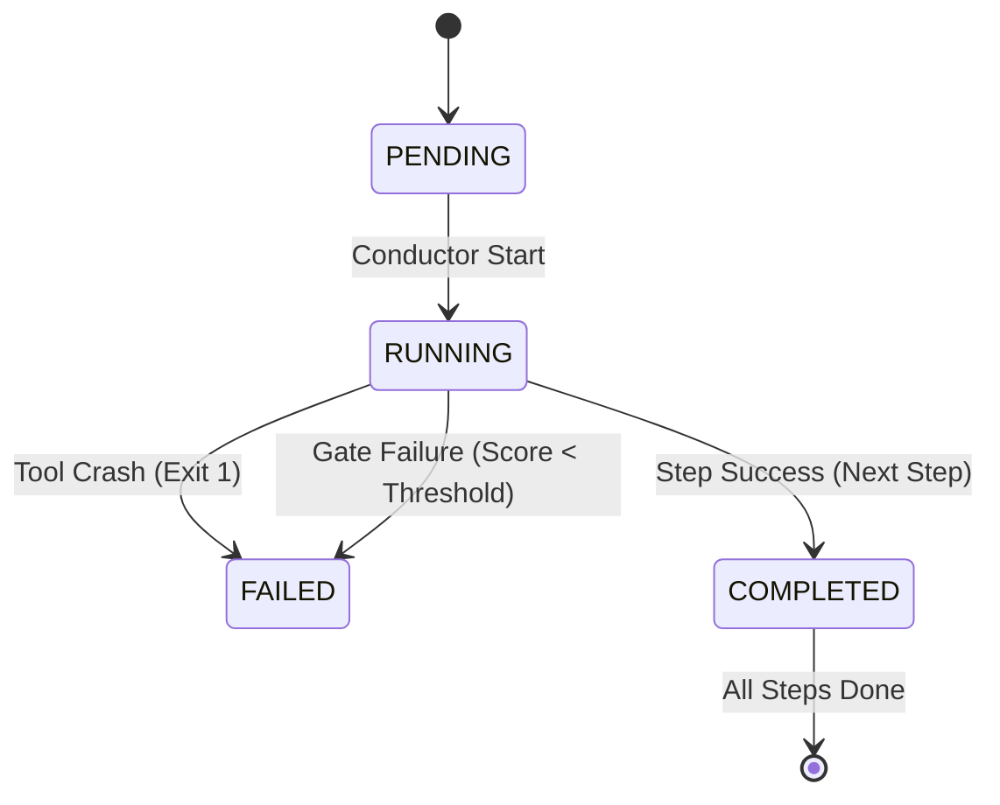

# Technical Contract: USNWR Ortho Demo (V1)

**Date**: 2024-12-23
**System**: Clinical Planner Conductor

This document defines the architectural guarantees of the Mission Control system built for the Orthopedics Demo.

---

## 1. Artifact Outputs (The Contract)

Every "Atom" (Mission) must produce a strictly typed JSON artifact in the Flight directory.

**Flight Directory**: `output/runs/{campaign_id}_{timestamp}_{metric}/`

| Step | Tool | Output Artifact | Schema / Shape |
| :--- | :--- | :--- | :--- |
| **Ingest** | `plan:ingest` | `plan.json`, `prompts.json` | `PlannerPlan`, `Prompts` |
| **Strategy** | `strategy:derive` | `strategy.json` | `BatchStrategy` (Coverage Goals + Scenarios) |
| **Generate** | `eval:generate` | `test_cases.json` | `TestCase[]` (Input + Expectations) |
| **Battle** | `eval:run-battle` | `eval_report.json` | `EvalReport` (Summary + Case Results) |
| **Certify** | `gov:certify` | `certified/...` | `prompts.json`, `certification.json` |

---

## 2. The State Machine

The Conductor manages the lifecycle of a **Flight** (one metric's journey through the factory).

*   **PASSED**: This is a logical state within the *Battle* step. If `Pass Rate > Threshold`, the step succeeds.
*   **CERTIFIED**: This is a side-effect of the *Certify* step completing.

---

## 3. The Dependency Graph (DAG)

The `flywheel:standard` track defines the following dependencies:

1.  **Ingest** (Root)
2.  **Strategy** (Requires `plan.json` for signal definitions)
3.  **Generate** (Requires `strategy.json` for scenarios)
4.  **Battle** (Requires `plan.json` for prompts + `test_cases.json` for data)
5.  **Certify** (Requires `eval_report.json` for audit + `plan.json` for content)

**Subset Runs**:
*   To run *only* Generation: Define a track ending at Step 3.
*   To run *from* Generation: Future feature (Inject existing `plan.json` into Flight Context).

---

## 4. Certification Policy

The system enforces quality through **Gates**.

**Configuration**: `tracks.ts` and `run-battle.ts`.

| Policy | Definition | Implementation |
| :--- | :--- | :--- |
| **Battle Gate** | `Pass Rate >= Threshold` | `run-battle.ts` exits with code 1 if failed. |
| **Safety Override** | `Safety Miss = FAIL` | Logic inside `run-battle.ts` (checks specific signal types). |
| **Certification Gate** | `Pass Rate >= Threshold` | `certify.ts` re-verifies report before copy. |

*Current Demo Settings:* Threshold = **0.0** (For demonstration flow).

---

## 5. Versioning Rules

**Artifacts**:
*   **Certified Path**: `certified/{framework}/{domain}/metrics/{metric}/{version}/`
*   **Current Rule**: Fixed at `v1`.
*   **Breaking Changes**: If `signals.json` changes, `ingest` produces a new plan. If certified, this should increment to `v2`.

**Prompt Versioning**:
*   Prompts are embedded in `plan.json`. They are versioned implicitly by the Run ID.
*   Certification "locks" a specific run's prompt as the `vN` release.
